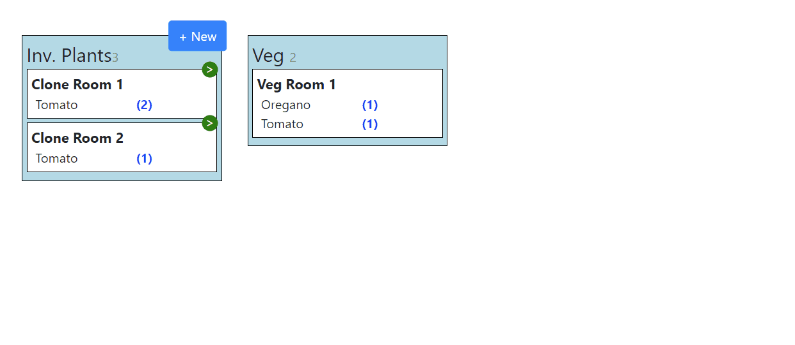

## Demo Features
A minimal grow process board with two stages
 - Create new clones from currently vegging plants
 - Create new plants from existing clones and destroy left overs 

This project was bootstrapped with [Create React App](https://github.com/facebook/create-react-app).

## Available Scripts

First run `npm install`, then you can run:

### `npm start`

Runs the app in the development mode. 
Open [http://localhost:3000](http://localhost:3000) to view it in the browser.

The page will reload if you make edits. 
You will also see any lint errors in the console.

### Technical Features
- Front-end only demo with dummy data (no data persistance) 
- Centralized data based on React hooks, context, and reducers
  - Normalized data using normalizr
  - Actions to create clones, plants, and show/hide the modal
- Abstracted components for board collumns and modals
- Typescript with minimal usage of any
- Organized and modularized solution structure

## Todo
- Demonstrate use of async functions by create a mock api for existing create actions
  - Update modals to show spinning button and wait for success to close
- Add testing with Jest
- Use Redux (hooks and context work great so far for centralized state, but just for experience)
- Hook up a router and add another page
- Add some local data persistance
- input validation on forms
- Destination rooms for new clones and plants are hardcoded, add the ability to select the target room
- 
## Known Bugs
- Modals will save changes no matter how you dismiss them
- no validation on form input, you can enter in numbers greater than current supply or negative numbers